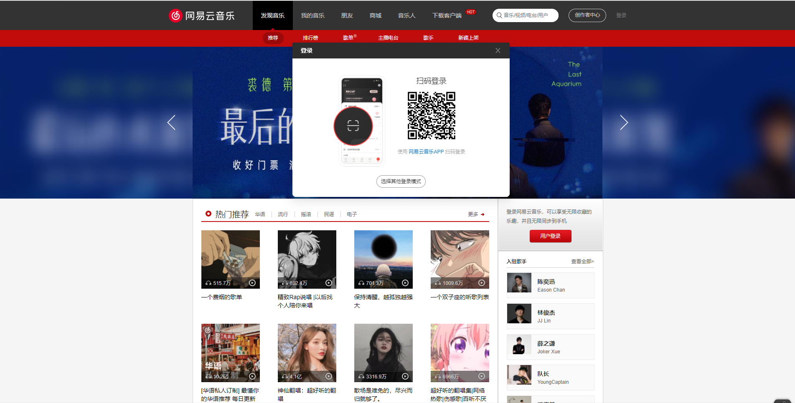
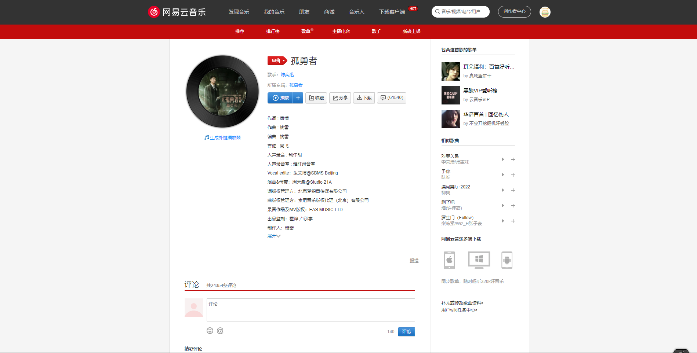
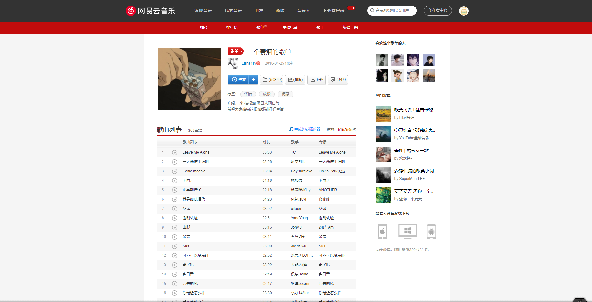
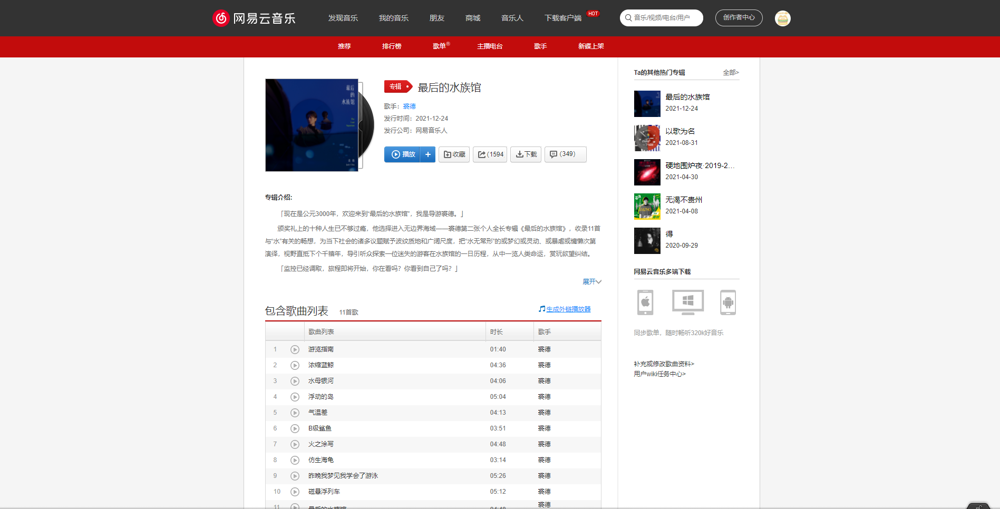
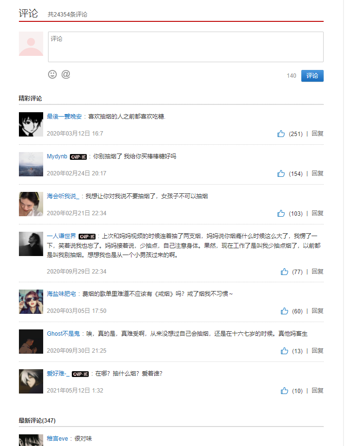
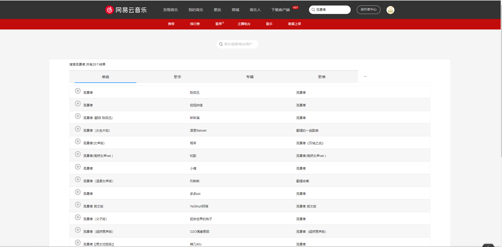
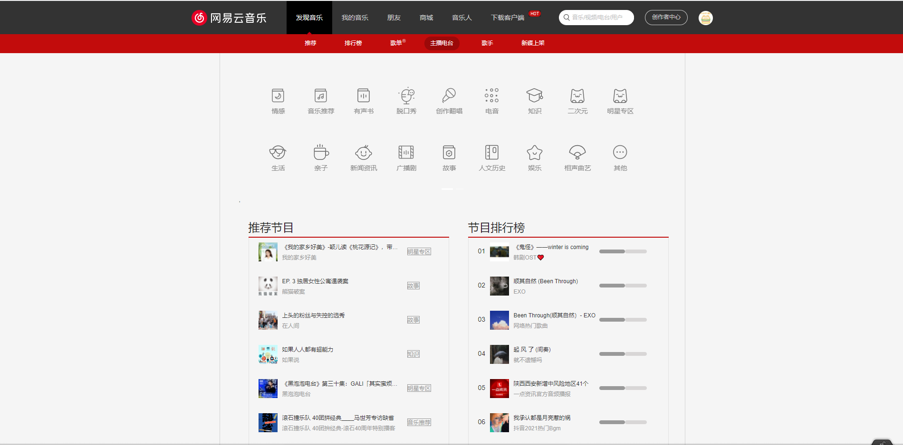
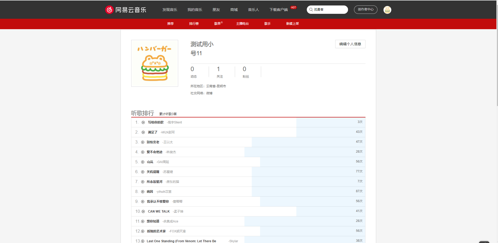

# React Netease Music
React Netease Music——一个基于React、TypeScript的高仿网易云音乐web端。

本项目是2021年腾讯文档与华中科技大学计算机学院校企联合课程最终的项目作业，小组成员包括组长赵桀，以及两位组员刘苡辛和王艳。

## 项目体验地址
[高仿网易云音乐播放器在线地址](http://www.arale.club)(不维护)

## 功能列表
- [x] 登录/登出（目前仅支持手机扫码登录）
- [x] 发现页
  - [x] banner
  - [x] 推荐歌单
  - [x] 推荐最新音乐
  - [x] 推荐专辑
- [x] 歌单详情页
- [x] 歌曲详情页
- [x] 专辑详情页
- [x] 评论展示
- [x] 分页功能
- [x] 搜索相关页
- [x] 主播电台页
- [x] 个人主页
- [x] 歌曲播放详情页
  - [x] 播放列表
  - [x] 歌词滚动
  - [x] 播放相关功能

注意：部分歌曲可能由于版权问题无法播放。

## 技术栈
- React
- TypeScript
- Restful
- less
- react-router
- mobx
- antd
- axios
- create-react-app
- webpack
- eslint
- Prettier

## API接口
- [NeteaseCloudMusicApi](https://github.com/Binaryify/NeteaseCloudMusicApi)

## 实现的相关截图




















## 项目启动
- 首先将上面👆提到的API接口拉到本地，跑在4000端口。
- 然后拉取本仓库代码，并执行以下命令：
```
yarn
yarn start
```
- 最后在浏览器中访问：`http://localhost:3000`

## 已知未修复bug
- 点击专辑页进行播放时，可能获取不到音乐的url。
- 在详情页时，如果输入的id不存在，会使得页面崩溃。
- 点击首页的轮播图，有时会跳转到一个不存在的网页导致页面崩溃。
- 当项目被部署到服务器上时，由于chrome安全原因，部分设备及浏览器上播放歌曲时可能报错，需要修改chrome相关配置。
- 同上，登录时不能设置cookie，因此登录功能失效。
- 两次搜索同一个词可能会显示查不到

## 特别鸣谢
- 在此特别鸣谢一下两位腾讯的导师钟远维和尹光耀，他们二位在我开发的过程中给予了我极大的帮助，不厌其烦地解答我遇到的各种问题，再次感谢二位！